# Explanations

## Growth Patterns

Sphagnum grow upwards or prostrate depending on the relative wetness and species.

## Sphagnum Structure

The chapters below will serve as a guide for understanding the most important parts of sphagnum used to identify them. It also serves as a general overview of the structural organization of sphagnum.

A sphagnum consists of:

* A  which serves as a head and sits at the top of the 

* Branches which lays flat to or sticks out from the stem

* Leaves, of which it has two types, one type which covers the branches and the other type which lays flat on or sticks out from the stem

  
↑ Sphagnum lindbergii

### Capitulum

The head or capitulum of a sphagnum is a cluster of young branches at the top of the stem. As the stem grows the capitulum branches will end up as the adult branches you can spot further down the stem. The capitulum is often star like in shape, especially when viewed from above, and often has a visible top bud. The  of the capitulum is often used as an identifying trait for certain species. The top bud or lack thereof, as well as how the capitulum branches rotate and curve is often a very useful identifying trait for certain species.  
Some species like S. annulatum always has a prominent top bud whereas a species like S. cuspidatum almost never has a visible top bud. It makes sense then that S. majus, which is a hybrid between the two, comes with a top bud visibility which slides to either extreme of the visiblity scale.

  
↑ Sphagnum majus, notice the star like shape of the head and the slightly hidden dark brown cylindrical top bud in the center. Also notice the unruly and "random" look of the small, central capitulum branches

  
↑ Sphagnum balticum, notice the less star like shape of the head and the lack of a easily visible top bud in the center. Also notice the straighter small, central capitulum branches and branch leaves as compared to sphagnum majus above

#### Additional Capitulum Examples { .collapse }

  
↑ Sphagnum molle, more or less flat capitulum where it's hard to seperate single sphagnums from each other. S. molle is normally not star shaped nor equiped with a visible top bud.

  
↑ Sphagnum obtusum, central small head branches turning inwards and hiding the top bud from view, also slightly stellate

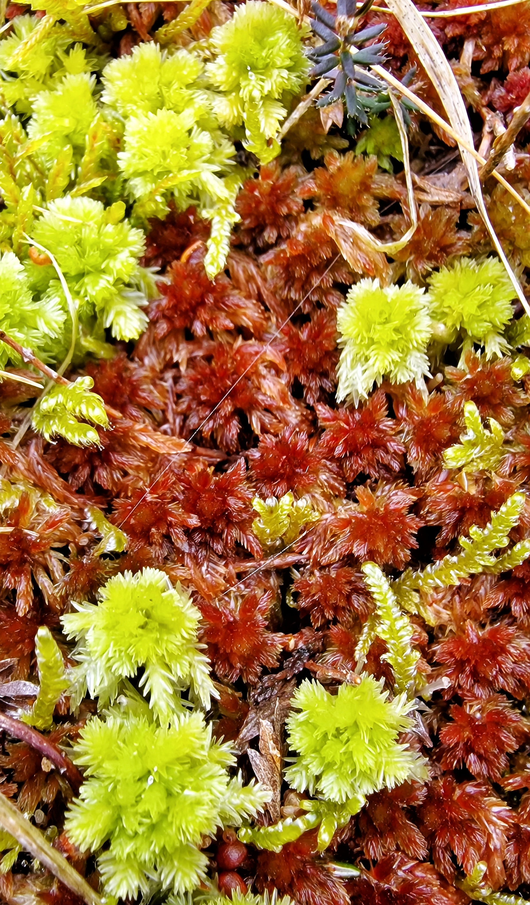  
↑ Sphagnum strictum (green) and subnitens (red), S. strictum with its pompom like head makes it hard to think sphagnum can be star shaped. S. subnitens shows a bit of top bud in this picture (the slightly yellow central part of the capitula)

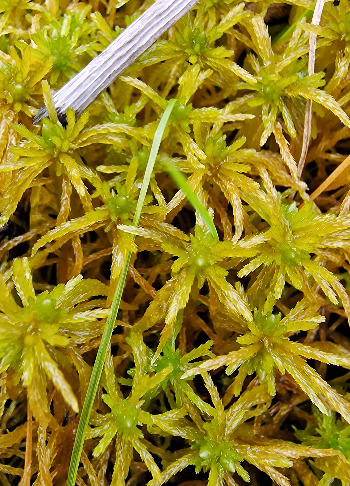  
↑ Sphagnum teres, the classic star shaped and visible top bud combo

  
↑ Sphagnum cuspidatum, also nicknamed "drowned cat" for its formless and chaotic capitula (but this is only when it is growing very wet)

### Stem

The stem of sphagnum is also sometimes used as a identifying trait for specific species. Flatberg has written about how certain species' stem snap easily, whilst others bend. I often use the colour of the stem as one trait in identification. For example S. girgensohnii cannot have a red stem (they can have brown and orange stems though), whilst the very similar species S. russowii does often have at least red speckles in it stem. Therefore, if you find a S. girgensohnii with red in its stem, it should point you towards checking other identifying traits for S. russowii or other lookalikes that can have red in its stem.  
Some sphagnum have alternate permanent colour forms. For example S. russowii, which sometimes shows up completely orange. However, the stem will still have its traditional colouring of a sliding and speckled scale of green to red. The same logic also follows other sphagnum with alternate permanent colour forms.

  
↑ Sphagnum annulatum, stem with branches and stem leaves attached

#### Stem Cross Section

After cutting a  from a sphagnum's stem you will see three often distinct layers. These, especially the cortex, or the lack of these are sometimes used as an identifying trait of certain sphagunm species. Sometimes these layers are difficult to see the difference between these layers.

  
↑ Sphagnum russowii stem cross section, image source: [Bartosz Czołczyński](https://www.inaturalist.org/people/bagli), [Inaturalist 31.12.25](https://www.inaturalist.org/observations/328391996),[CC BY-NC 4.0](https://creativecommons.org/licenses/by-nc/4.0/), edited by me to differentiate layers with text and contrast  

1. The  is the outermost zone of the stem when looking at a cross section. It consists of large cortical cells. The number of layers, or relative lack of  cells is sometimes used as an identifying trait of certain sphagnum species.

2. The  is the layer underneath the cortex. These thicker and smaller cells are often more clearly coloured. The colours vary and depends on the species of the sphagnum and is sometimes used as a identifying trait for certain species.

3. The central parenchyma, which is the inermost layer.

↑ Sphagnum annulatum stem cross section, with parts of the cortical cells completely lacking. One of the species traits of S. annulatum is a poorly developed or lacking stem cortical cells, as opposed to S. jensenii (a hybrid between S. annulatum and S. balticum) which should have ~3 layers of cortical cells.

#### Stem Cortex Closeup

↑ Sphagnum affine, here's a closeup of the stem of a sphagnum. Notice the round circles  attached to square-like seethrough layer of cortical cells? That is the  The brown cyllinder that you can see through the cortex is the afformentioned layer called   

↑ Sphagnum affine, here is the same picture as above but stained with purple ink. This makes it easier to see the seethrough cortical cells and their pores. Many sphagnum do not have pores in the cortical cells. These types of pores are found in all sphagnum subgenus Sphagnum, and some Acutifolia.

↑ Sphagnum affine, here's the stem cortex ripped off the stem. You can now very easily see the cortical cells and the .

↑ Sphagnum affine, on the back of the cortical cells you can sometimes find . Those are the "wrinkles" you can see criss-crossing the cortical cells in this image. Notice that this image is the exact same image as above, except the focus of the lens was set on the back instead of the front of the cortical cells. Also notice that all sphagnum subgenus Sphagnum has these fibrils in their cortical cells.

### Branches

Sphagnum branches are attached to the stem in . These bundles of branches are split into two types.

1. The  branches.
   * The divergent or spreading branches are often more robust as compared to the pendent branches. They spread outwards from the stem. 
2. the  branches.
   * The pendent branches are often more delicate as compared to the spreading branches. They are most often hanging downwards and apressed or slightly elevated from the stem.

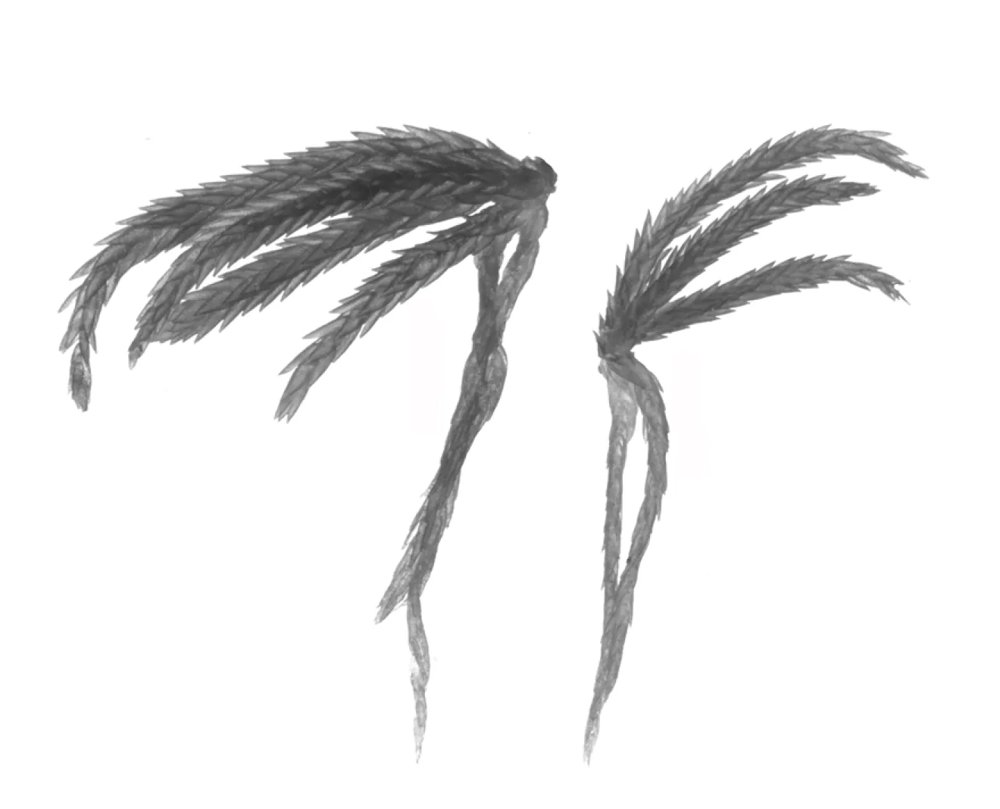
↑ Sphagnum quinquefarium . Famous for most often having 3 (sometimes 2,3 or 4) divergent branches. Image Source: Kjell Ivar Flatberg: Lyngtorvmose Sphagnum quinquefarium (Braithw.) Warnst. Collected 02.01.2026 from https://artsdatabanken.no/arter/takson/188782/beskrivelse.

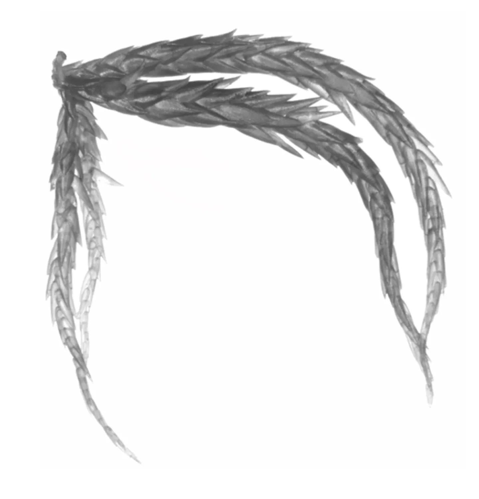
↑ Sphagnum annulatum . Divergent branches that are normally thickest in the middle of the branch. The leaves of divergent branches often start out as tiny and gradually becomes longer until the middle of the branch. Image Source: Kjell Ivar Flatberg: Pisktorvmose Sphagnum annulatum H.Lindb. ex Warnst. Collected 02.01.2026 from https://artsdatabanken.no/arter/takson/188573/beskrivelse.

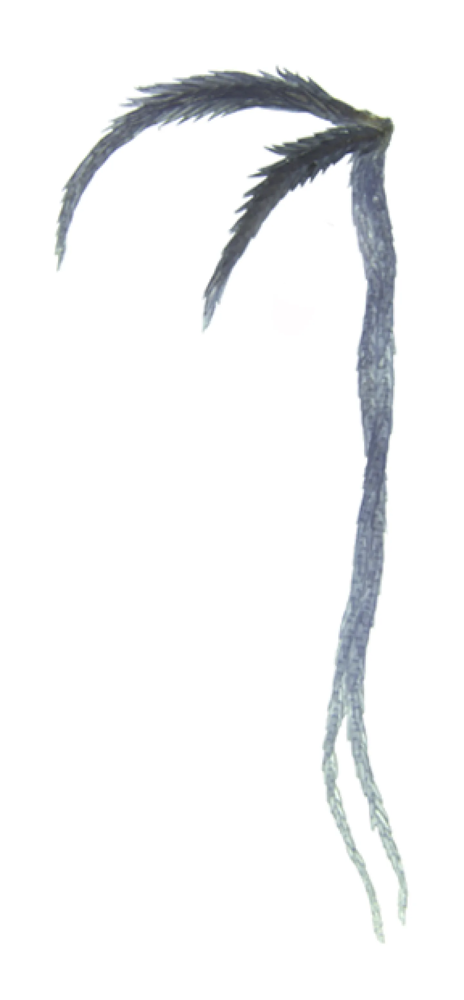
↑ Sphagnum angustifolium, famous for often having much longer pendent branches as compared to the divergent branches. Image Source: Kjell Ivar Flatberg: Klubbetorvmose Sphagnum angustifolium (C.E.O.Jensen ex Russow) C.E.O.Jensen. Collected 02.01.2026 from https://artsdatabanken.no/arter/takson/188745/beskrivelse.

### Leaves

Sphagnum has two types of leaves called branch and stem leaves.

#### Branch leaves

These leaves are found on the two types of branches of a sphagnum. These leaves contain a lot of useful information for identifying different types of sphagnum. Especially the general look and size of the leaf, as well as the . Other useful features could for example be  of Sphagnum papillosum and the  of the sphagnum imbricatum complex (S. imbricatum, S. austinii, S. affine and S. steerei). A good practice is to only use leaves found in the middle of the branches for identification with a microscope. Also each leaf can vary a lot from individual to individual so it is good practice to use multiple different leaves (this is also true for stem leaves).

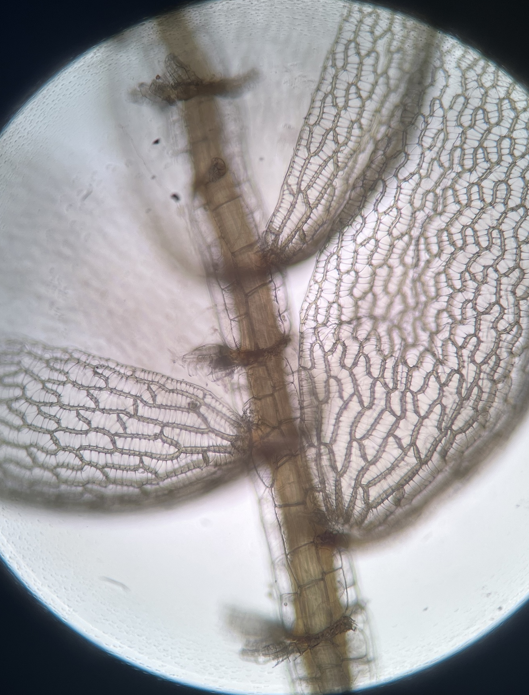
↑ Sphagnum papillosum, branch leaves still attached to the branch itself. Image Source: [Brad Von Blon](https://www.inaturalist.org/people/bobcatbrad) taken from [Inaturalist 02.01.26](https://www.inaturalist.org/observations/323323957), [CC BY-NC 4.0](https://creativecommons.org/licenses/by-nc/4.0/)

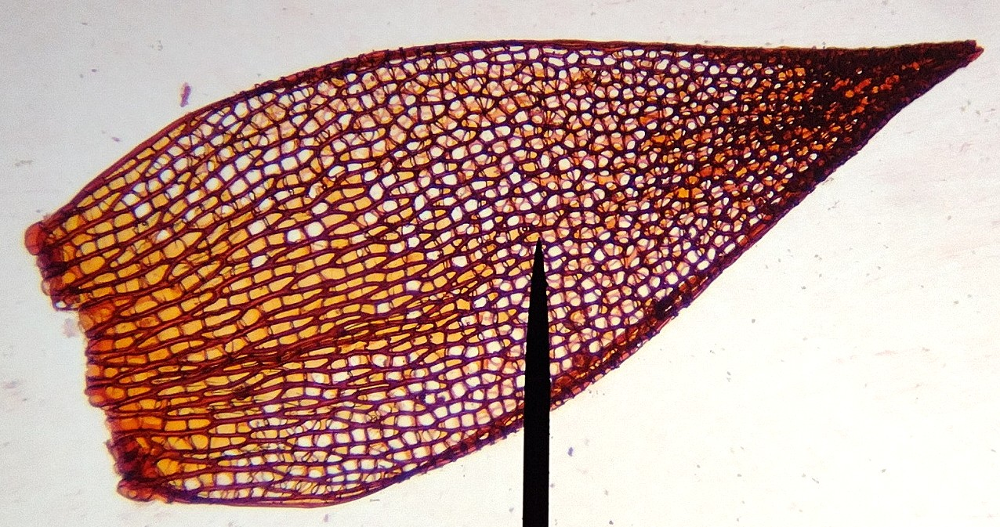
↑ Sphagnum fimbriatum branch leaf. Image Source: [Bartosz Czołczyński](https://www.inaturalist.org/people/bagli) taken from [Inaturalist 02.01.26](https://www.inaturalist.org/observations/324685807), [CC BY-NC 4.0](https://creativecommons.org/licenses/by-nc/4.0/)

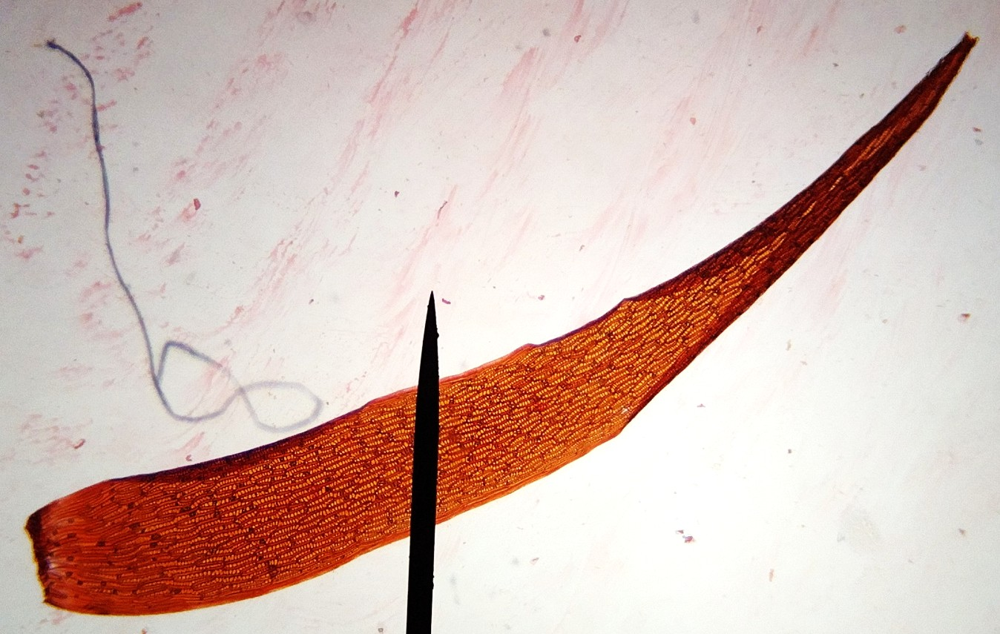
↑ Sphagnum cuspidatum branch leaf. Image Source: [Bartosz Czołczyński](https://www.inaturalist.org/people/bagli) taken from [Inaturalist 02.01.26](https://www.inaturalist.org/observations/324582266), [CC BY-NC 4.0](https://creativecommons.org/licenses/by-nc/4.0/), image cropped by me

#### Stem leaves

These leaves are found attached to the stem of the sphagnum. They differ in shape from the branch leaves quite a bit and for some species you would only need to see a stem leaf even without seeing the moss itself to identify it. Stem leaves are often one of the best identifiers for different sphagnum species.  
It's not just the shape and size of the stem leaves that you can use for identification purposes, but also their orientation on the stem itself. For example, if you are unsure if you're holding an S. fallax or an S. balticum in your hand, and do not have a loupe to check the tip of the stem leaf itself (S. fallax often has a nippled stem leaf tip), you could check if the stem leaves were sticking out in all kinds of angles. If you have stem leaves that are sticking straight out, but also in every other degree towards both the ground (mostly) and the sky (somtimes), it's most likely S. balticum. This comes with a caveat though, as S. fallax can have stem leaves out at an angle, even though on average (at least in South Western Norway) most stem leaves are hugging the stem itself pointing downwards. And S. balticum can come with stem leaves that more or less hug the stem and pointing downwards when they're growing in richer (nutrients) environments. These types of traits can be very useful as long as it's not the only trait you rely on.

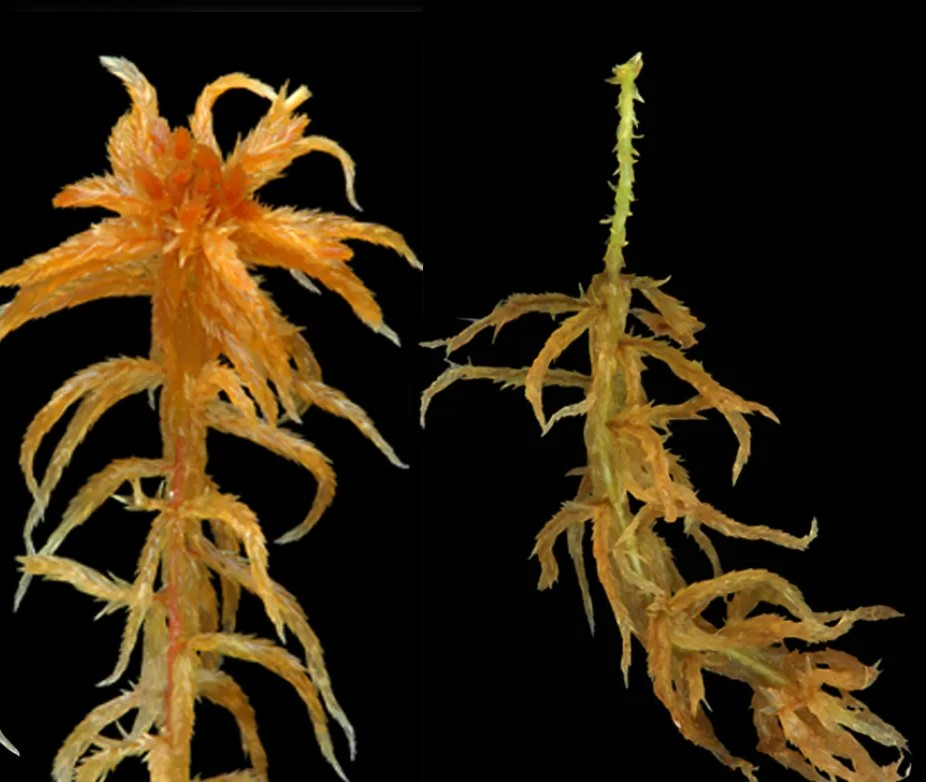
↑ Sphagnum balticum, you can see the stem leaves pointing out in multiple directions as compared with S. fallax below. Image Source: Kjell Ivar Flatberg: Svelttorvmose Sphagnum balticum (Russow) C.E.O.Jensen. Collected 02.01.2026 from https://artsdatabanken.no/arter/takson/188762/beskrivelse.

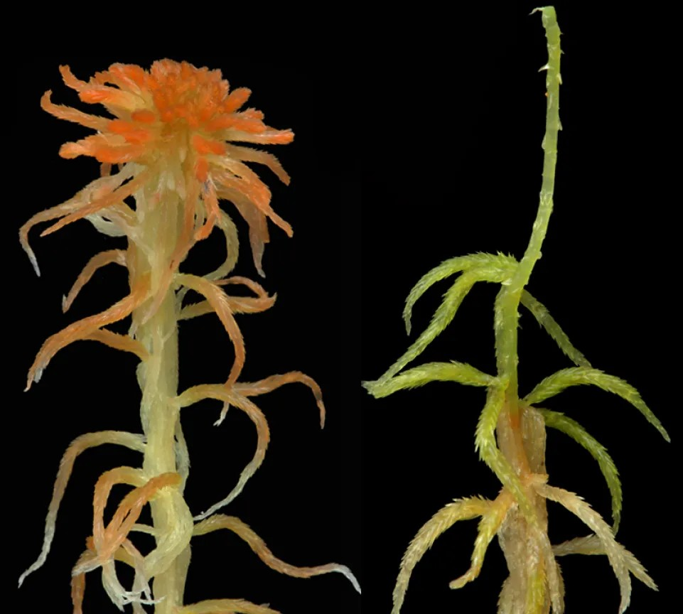
↑ Sphagnum fallax, you can see the stem leaves pointing more downwards as compared with S. balticum above. Image Source: Kjell Ivar Flatberg: Broddtorvmose Sphagnum fallax (H.Klinggr.) H.Klinggr. Collected 02.01.2026 from https://artsdatabanken.no/arter/takson/188746/beskrivelse.

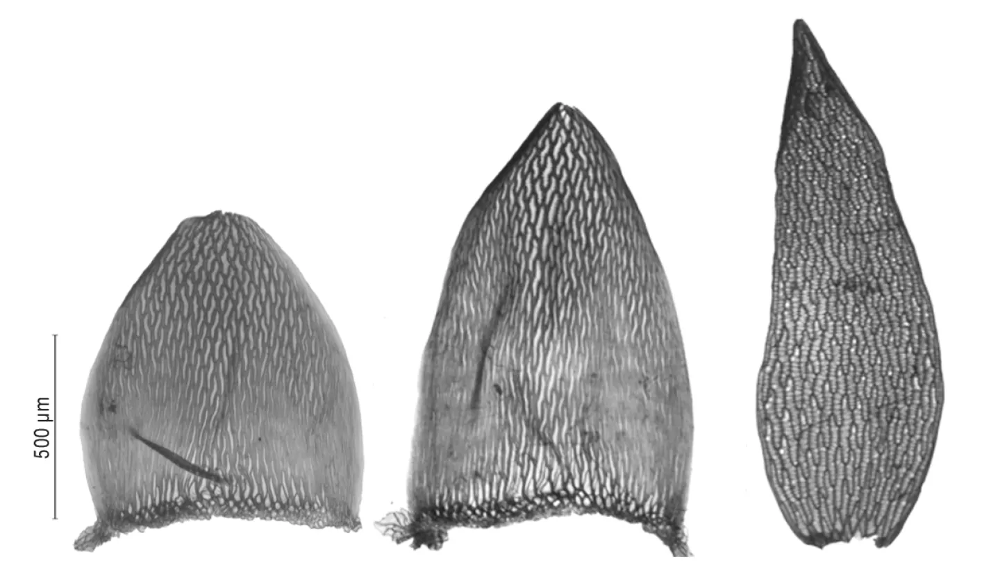
↑ Sphagnum balticum, two stem leaves on the left and one branch leaf on the right. Image Source: Kjell Ivar Flatberg: Svelttorvmose Sphagnum balticum (Russow) C.E.O.Jensen. Collected 02.01.2026 from https://artsdatabanken.no/arter/takson/188762/beskrivelse.

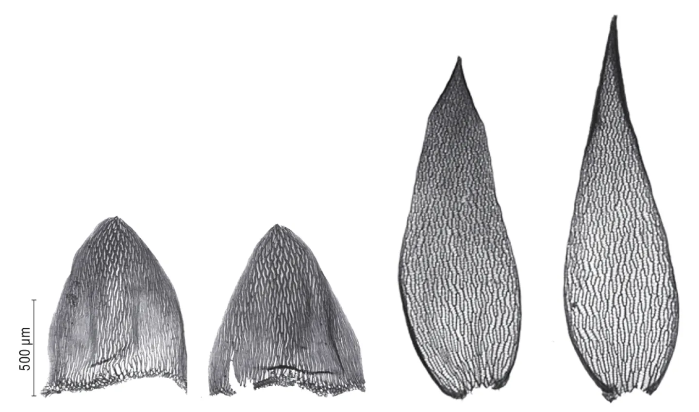
↑ Sphagnum fallax, two stem leaves on the left and two branch leaves on the right. Image Source: Kjell Ivar Flatberg: Broddtorvmose Sphagnum fallax (H.Klinggr.) H.Klinggr. Collected 02.01.2026 from https://artsdatabanken.no/arter/takson/188746/beskrivelse.

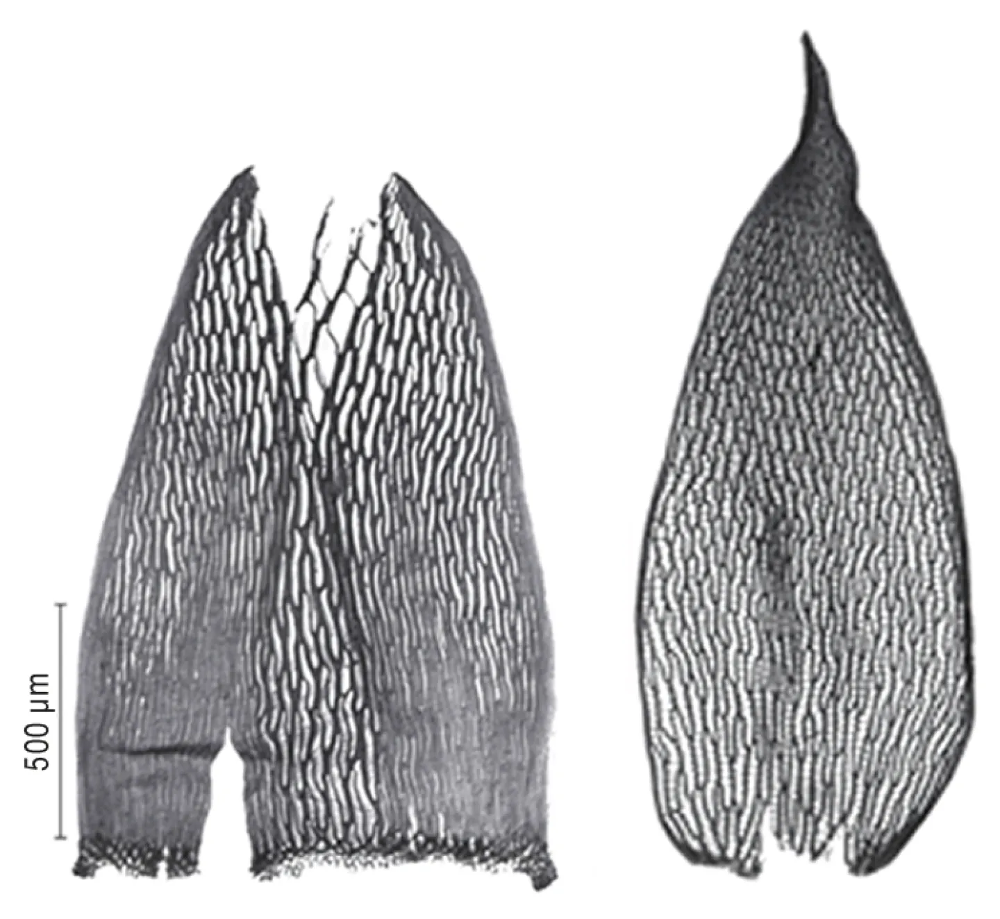
↑ Sphagnum riparium, which has a "rip" in it's stem leaf, seen on the left. It's one of the sphagnum you can identify solely based on the stem leaf. As long as the specimen was not found in artic conditions as the "rip" is not as clear when growing in those conditions. Sphagnum always seem to have caveats. Image Source: Kjell Ivar Flatberg: Skartorvmose Sphagnum riparium Ångstr. Collected 02.01.2026 from https://artsdatabanken.no/arter/takson/188785/beskrivelse.

#### Leaf Cells

In Sphagnum both branch and stem leaves both consists of two types of cells. You can easily see these under the microscope and they're often used for identifying certain sphagnum species.

1. : Transparent cells which store water and are explained more in detail below.
2. : Cells that have chlorophyll and give the sphagnum their colour.

↑ Sphagnum palustre, notice the seethrough large cells (hyaline cells) that are criss crossed by thin lines which are called fibrils (not a type of cell). The darker (they're green) and slender lines, which seem to envelop the seethrough cells, are chlorocyst cells. Image Source: [ipami](https://www.inaturalist.org/people/ipami) taken from [Inaturalist 02.01.26](https://www.inaturalist.org/observations/321507341), [CC BY-NC 4.0](https://creativecommons.org/licenses/by-nc/4.0/), image cropped by me

↑ Sphagnum palustre, same plant as above, here you can see a closeup of a picture above. You can clearly see the round  in the seethrough  and the green  cells surrounding them. Often the pores are hard to see without staining the cells (or entire branch leaf) with a colourful ink. Image Source: [ipami](https://www.inaturalist.org/people/ipami) taken from [Inaturalist 02.01.26](https://www.inaturalist.org/observations/321507341), [CC BY-NC 4.0](https://creativecommons.org/licenses/by-nc/4.0/), image cropped and rotated by me

### Hyaline cells and 
TODO

<!---- 
### Fibrils

Fibrills are essentially spiral- or rip-like structures helping to sustain a certain form. When water is evaporating out of the plant the negative turgor could cause cavities to collapse. This would of course hindering the water intake. Often structures under that kind of physical stress (negative pressures) have that kind of structures, e.g. our windpipe or the a vacuum cleaner's tube.  
Although fibrills are a general trait of branch leaves in most Sphagnales, the derived stem leaves do not have that need for this function of conduct water. For Sphagnum species that don't normally have stem leaf fibrils, when water stress is high enough this trait can be seen as an rudimental feature in stem leaves again.  
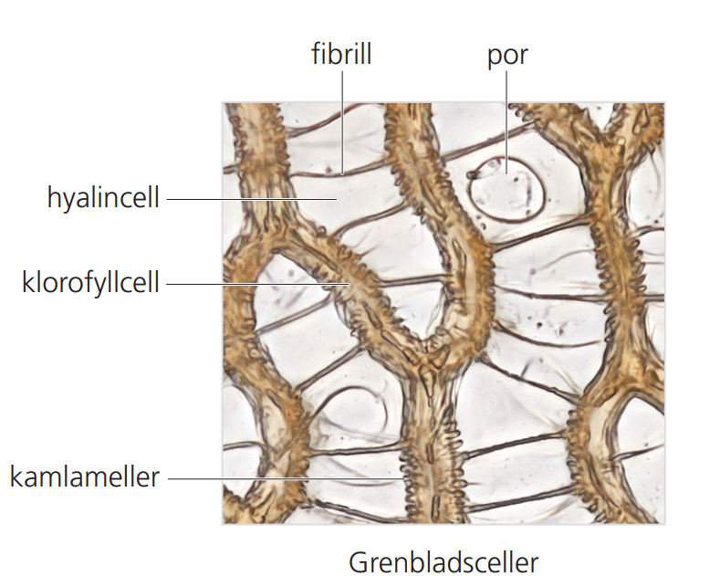

Sources: [Inaturalist](https://www.inaturalist.org/observations/287369385), [artdatabanken.se](https://assets.artdatabanken.se/pdf/45380_1004718.pdf)
---->

## Sources

<ol>
  <li id="ayotte2020">Ayotte, G., & Rochefort, L. (2020). <em>Sphagnum Mosses of eastern Canada: Biology — Anatomy — Morphology — Herbarium conservation techniques and microscopic preparations</em>. Editions JFD.</li>
  <li id="daniels1990">Daniels, R.E. & Eddy, A. (1990). <em>Handbook of European Sphagna</em>, 2. ed. HMSO, London. 284 s.</li>
  <li id="denismichelle1997">Denis-F. Bastien, Michelle Garneau (1997). <em>MACROSCOPIC IDENTIFICATION KEY OF 36 SPHAGNUM SPECIES IN EASTERN CANADA</em>. Online: https://nswildflora.ca/wp-content/uploads/2021/05/Sphagnum-ID-Eastern-Canada.pdf</li>
</ol>
