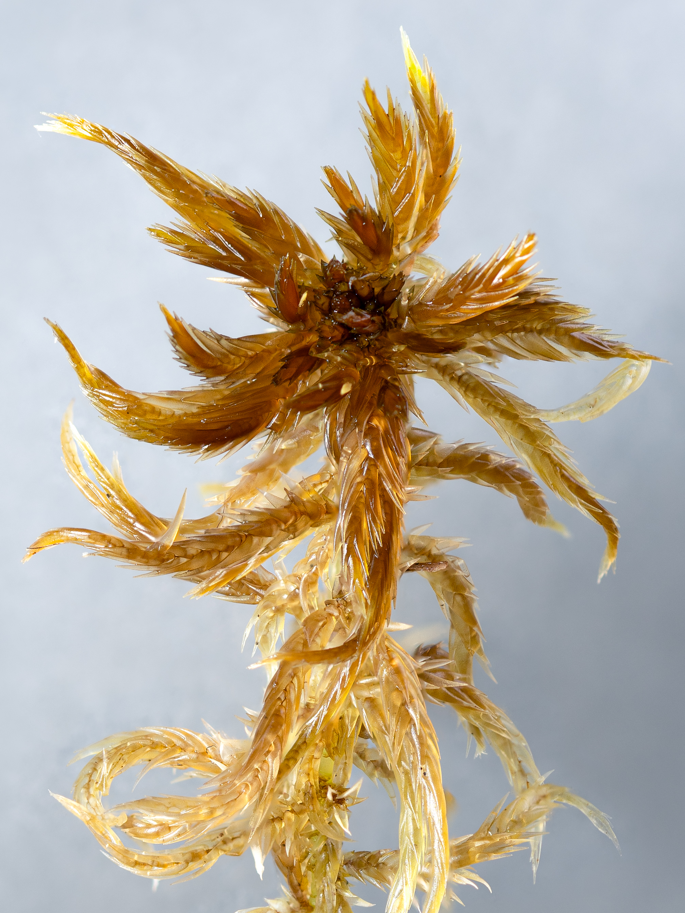
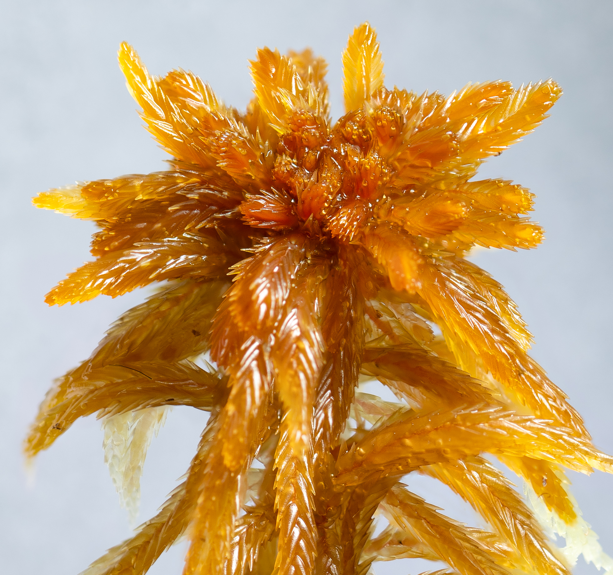

# Explanations

## Growth Patterns

Sphagnum grow upwards or prostrate depending on the relative wetness and species.

## Sphagnum Structure

The chapters below will serve as a guide for understanding the most important parts of sphagnum used to identify them. It also serves as a general overview of the structural organization of sphagnum.

A sphagnum consists of:

* A  which serves as a head and sits at the top of the 

* Branches which lays flat to or sticks out from the stem

* Leaves, of which it has two types, one type which covers the branches and the other type which lays flat on or sticks out from the stem

  
↑ Sphagnum lindbergii

### Capitulum

The head or capitulum of a sphagnum is a cluster of young branches at the top of the stem. As the stem grows the capitulum branches will end up as the adult branches you can spot further down the stem. The capitulum is often star like in shape, especially when viewed from above, and often has a visible top bud. The  of the capitulum is often used as an identifying trait for certain species. The top bud or lack thereof, as well as how the capitulum branches rotate and curve is often a very useful identifying trait for certain species.  
Some species like S. annulatum always has a prominent top bud whereas a species like S. cuspidatum almost never has a visible top bud. It makes sense then that S. majus, which is a hybrid between the two, comes with a top bud visibility which slides to either extreme of the visiblity scale.

  
↑ Sphagnum majus, notice the star like shape of the head and the slightly hidden dark brown cylindrical top bud in the center. Also notice the unruly and "random" look of the small, central capitulum branches

  
↑ Sphagnum balticum, notice the less star like shape of the head and the lack of a easily visible top bud in the center. Also notice the straighter small, central capitulum branches and branch leaves as compared to sphagnum majus above

### Stem

  
↑ Sphagnum annulatum

### Branches

### Leaves

### Hyalocysts

### Fibrils

Fibrills are essentially spiral- or rip-like structures helping to sustain a certain form. When water is evaporating out of the plant the negative turgor could cause cavities to collapse. This would of course hindering the water intake. Often structures under that kind of physical stress (negative pressures) have that kind of structures, e.g. our windpipe or the a vacuum cleaner's tube.  
Although fibrills are a general trait of branch leaves in most Sphagnales, the derived stem leaves do not have that need for this function of conduct water. For Sphagnum species that don't normally have stem leaf fibrils, when water stress is high enough this trait can be seen as an rudimental feature in stem leaves again.   

Sources: [Inaturalist](https://www.inaturalist.org/observations/287369385), [artdatabanken.se](https://assets.artdatabanken.se/pdf/45380_1004718.pdf)

# Glossary<a href="#ayotte2020">1</a>|<a href="#daniels1990">2</a>|<a href="#denismichelle1997">3</a>
<!--  Collects each item in the glossary.yml file and prints them on this page -->

**{{ term[0] }}** - {{ term[1] }}



## Sources

<ol>
  <li id="ayotte2020">Ayotte, G., & Rochefort, L. (2020). <em>Sphagnum Mosses of eastern Canada: Biology — Anatomy — Morphology — Herbarium conservation techniques and microscopic preparations</em>. Editions JFD.</li>
  <li id="daniels1990">Daniels, R.E. & Eddy, A. (1990). <em>Handbook of European Sphagna</em>, 2. ed. HMSO, London. 284 s.</li>
  <li id="denismichelle1997">Denis-F. Bastien, Michelle Garneau (1997). <em>MACROSCOPIC IDENTIFICATION KEY OF 36 SPHAGNUM SPECIES IN EASTERN CANADA</em>. Online: https://nswildflora.ca/wp-content/uploads/2021/05/Sphagnum-ID-Eastern-Canada.pdf</li>
</ol>
