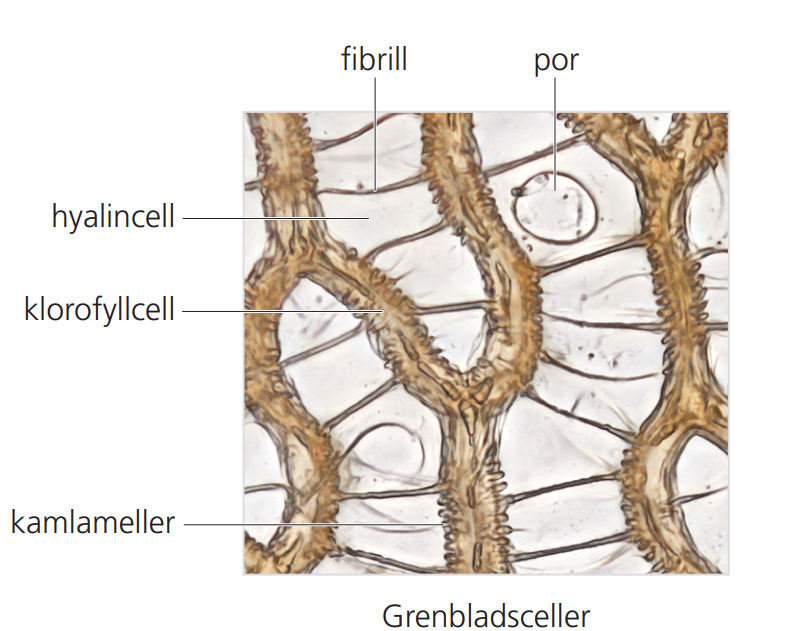

# Fibrils
Fibrills are essentially spiral- or rip-like structures helping to sustain a certain form. When water is evaporating out of the plant th enegativ turgor could cause cavities to collapse. This would of course hindering the next water intake. Often structures under that kind of physical stress (negative pressures) have that kind of structures, e.g. our windpipe or the a vacuum cleaner's tube.  
Although fibrills are a general trait of branch leaves in most Sphagnales, the derived stem leaves do not have that need for this function of conduct water. For Sphagnum species that don't normally have stem leaf fibrils, when water stress is high enough this trait can be seen as an rudimental feature in stem leaves again.

Sources: [Inaturalist](https://www.inaturalist.org/observations/287369385), [artdatabanken.se](https://assets.artdatabanken.se/pdf/45380_1004718.pdf)