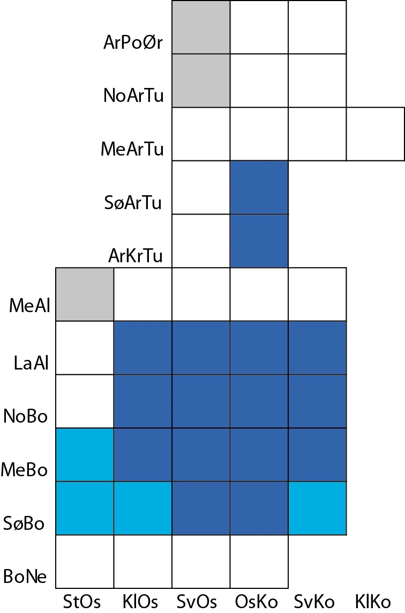
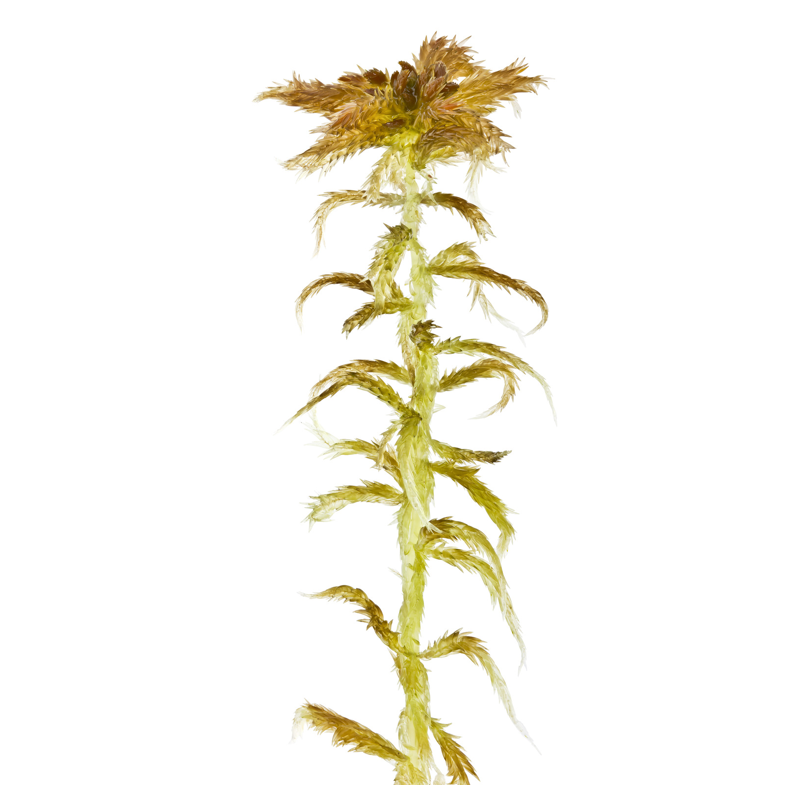
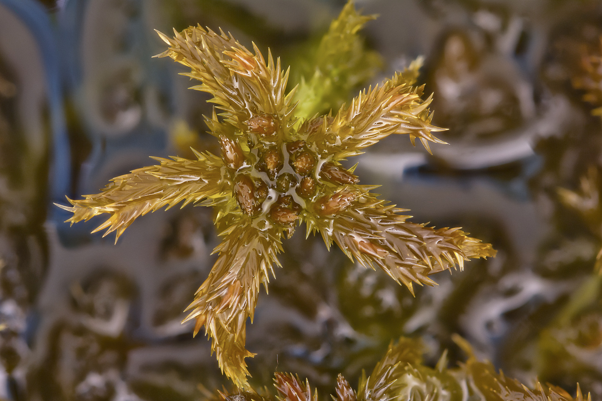
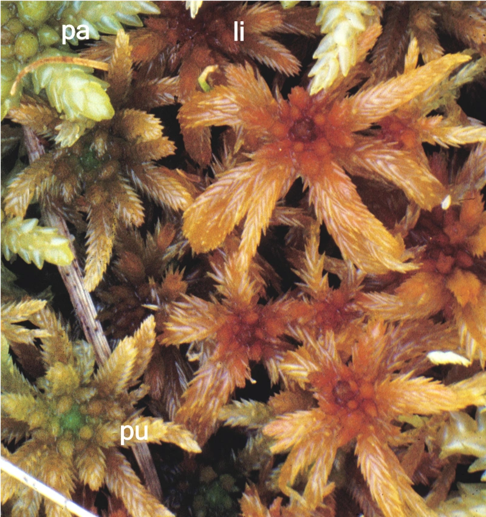
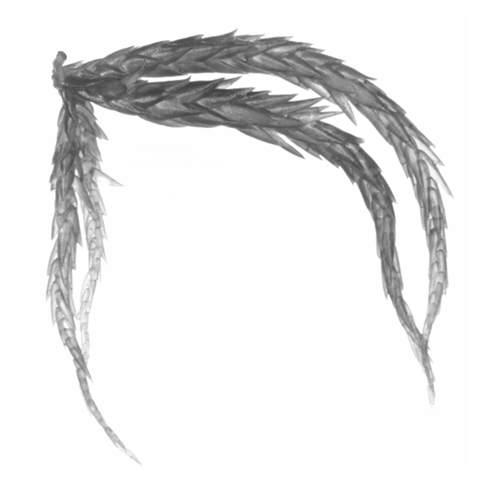
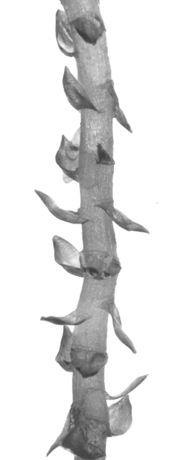
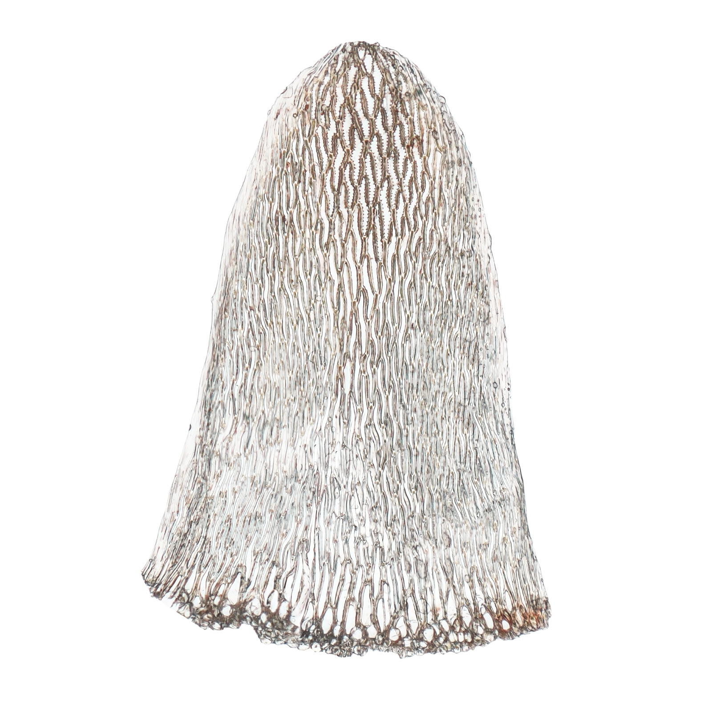
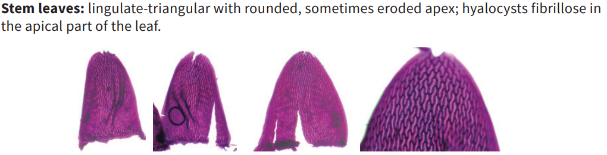
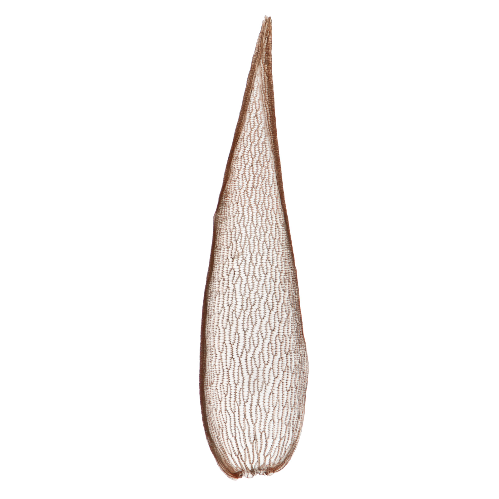
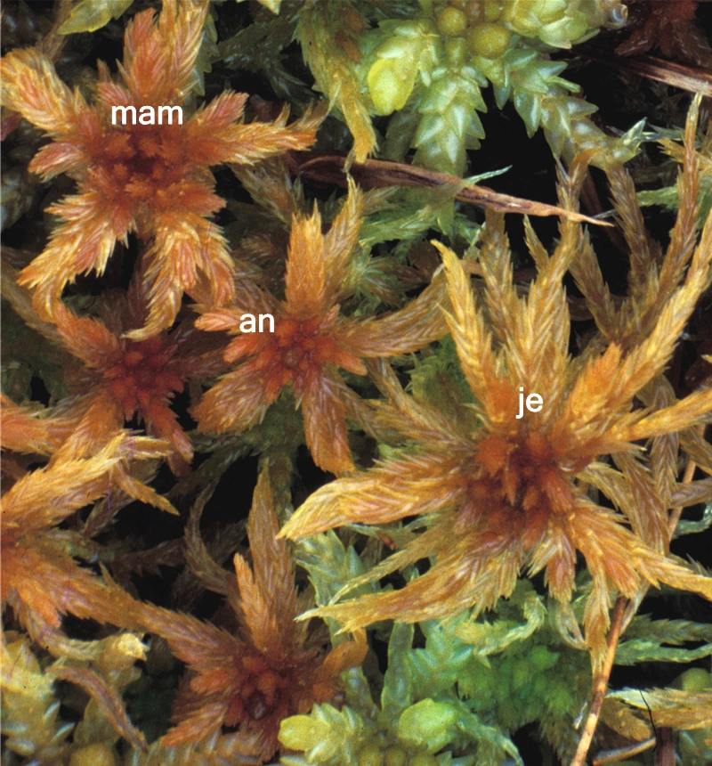

# Sphagnum annulatum

## Description

Small to medium size

Capitulum shiny chestnut brown.

Apical bud normally obvious, usually levelled or only slightly shorter than the inner branches, and almost always always visible.

Fascicles loosely arranged and typically displaying two divergent and 1–2 pendent branches that separate slightly from the main stem.

The divergent branches often curved downwards and are often pronouncedly thickest in middle part; the pendent branches are slender and shorter. The stem leaves stick out from the stem.

As moisture increases, the shoots and heads become more robust; the outer branches and projecting parts tend to elongate and straighten. Capitulum of male plantsdistinctly vaulted heads with short, dark-brown antheridial branches.

On rare occasions, a completely green color variant may occur.

Acts as a reliable indicator of minerothrophic wetlands. Never found in nutrient poor bogs.

## Macro

## Micro

## Lookalikes

S. majus
S. jensenii
S. balticum

Sphagnum jensenii is mainly differentiated from S. annulatum and S. balticum by its longer spreading branches, branch leaves and stem leaves.

The stem of Sphagnum annulatum (cross-section) has undifferentiated or poorly differentiated cortical cells, whereas the stems of S. majus and S. jensenii have clearly differentiated cortical cells.

Compared to S. jensenii, S. annulatum is less robust, smaller, more chestnut brown (less yellow-brown) and its branches are slightly curved; the capitulum is more clearly star-shaped with a distinct apical bud.

Krusvitmossa är mycket lik piskvitmossa Sphagnum jensenii som dock är kraftigare, har rakare grenar, otydligare toppknopp, få eller inga runda porer i hya­lincellerna på konvexsidan i basala delen av grenbladet (där hyalincellerna även är längre jäm­fört med de i mellersta delen (obs: S. annulatum can have larger pores in the basal bit of the branch leaf, but reportedly not "longer")), stamblad som är relativt sett bredare (bredd:längdkvot större än 0,72) och stambark som är tydligare differentierad.

Parent species to S. jensenii together with S. balticum.

**Sources**:

Gilles Ayotte, Line Rochefort - Sphagnum Mosses of Eastern Canada-Éditions JFD (2020)

[Artfakta.se: krusvitmossa Sphagnum annulatum H.Lindb. ex Warnst.](https://artfakta.se/taxa/2883/information?src=1&class=11)

[Artsdatabanken.no: Pisktorvmose Sphagnum annulatum H.Lindb. ex Warnst](https://artsdatabanken.no/Pages/186268/)