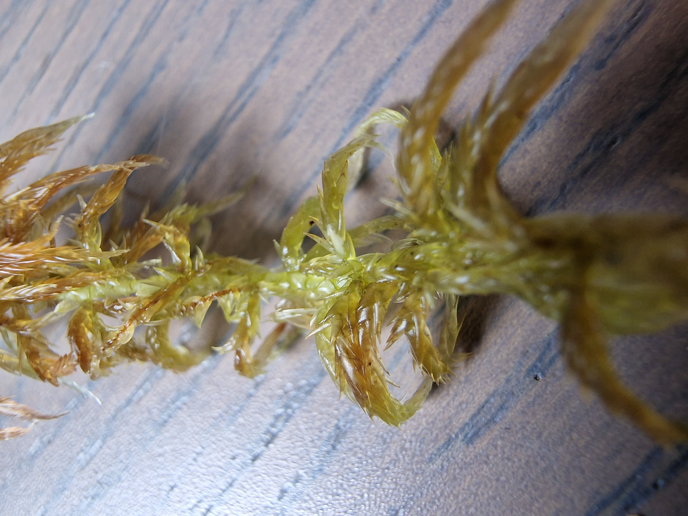

# Sphagnum annulatum

  

  

## Description
Small to medium size

Capitulum shiny. Orange-brown.

Apical bud normally obvious, usually levelled or only slightly shorter than the inner branches, and almost always visible.

Fascicles loosely arranged and typically displaying two divergent and 1–2 pendent branches that separate slightly from the main stem.

The divergent branches often curved downwards and are often pronouncedly thickest in middle part. Sometimes it will have very small leaves at the base of the divergent branches. Notice: Many sphagnum can display smaller leaves at the base of the divergent branches. The pendent branches are slender and shorter than the divergent branches. The stem leaves stick out from the stem.

As moisture increases, the shoots and heads become more robust; the outer branches and projecting parts tend to elongate and straighten. Capitulum of male plants distinctly domed heads with short, dark-brown antheridial branches.

On rare occasions, a completely green color variant may occur.

Acts as a reliable indicator of minerothrophic wetlands. Never found in ombrotrophic bogs.

## Habitat
Sphagnum annulatum is predominantly a mire species. But in subalpine and low alpine areas in Norway it is also sometimes found in spring and snow-bed vegetation on very shallow peat. In mires, it is an exclusively minerotrophic species. It prefers sloping fens, but is sometimes also found in topogenous fens.  
Along the "poor-rich" vegetational gradient, it has a fairly narrow amplitude; it occurs mainly in intermediate fens, more occasionally in transitional poor fens and rarely in rich fens. High-level carpets and lawns are the typical habitats on the "hummock-mud-bottom" vegetational gradient. More occasionally it is found in wetter carpets, and rarely at low hummock level. The surrounding vegetation always has a clear mire margin character.

## Macro Pics

## Micro Pics



## **Sources: Text & Images**:

Gilles Ayotte, Line Rochefort - Sphagnum Mosses of Eastern Canada-Éditions JFD (2020)

[Artfakta.se: krusvitmossa Sphagnum annulatum H.Lindb. ex Warnst.](https://artfakta.se/taxa/2883/information?src=1&class=11)

[Artsdatabanken.no: Pisktorvmose Sphagnum annulatum H.Lindb. ex Warnst](https://artsdatabanken.no/Pages/186268/)

[The Norwegian Sphagna: a field colour guide](https://ntnuopen.ntnu.no/ntnu-xmlui/handle/11250/271981)

## **Additional Images taken by yours truely**

  

  

  

  

  

  

  
↑ Can be found with  brown mosses (high nutrient demand)

  
↑ Can be reddish-brown

  

  

  

  

  

  

  

  

  

  

  

  

  

  

  
↑ Can be pretty sizable. Often S. lindbergii (middle left, and middle bottom of the image) is one of the largest European sphagnum.  

  

   

  

  

   

  

  

  

  

  

  

  

 

  

  
↑ Can have pores in one row instead of two as well  

  
↑ More commonly pores in two rows instead of one  

  
↑ Often has tiny ringed pores in the tip of the stem leaves  

  
↑ Common pore structure on concave side of branch leaf  

  
↑ Can sometimes have big and weirdly (not displayed in this image) shaped pores on the bottom, and sometimes throughout the branch leaves  

  
↑ More likely than not a good bit longer than wide stem leaf  

 

  
↑ Stem cortex not developed  

  
↑ Stem cortex slightly (1-2 rows) developed  

    
↑ Common branch leaf shape 

  
↑ Branch leaf cells of similar size from the bottom to the middle of the leaf  

  
↑ Branch leaf cells of similar size from the bottom to the middle of the leaf  

  
↑ Branch leaf cells of similar size from the bottom to the middle of the leaf  

  
↑ Branch leaf cells of similar size from the bottom to the middle of the leaf  
