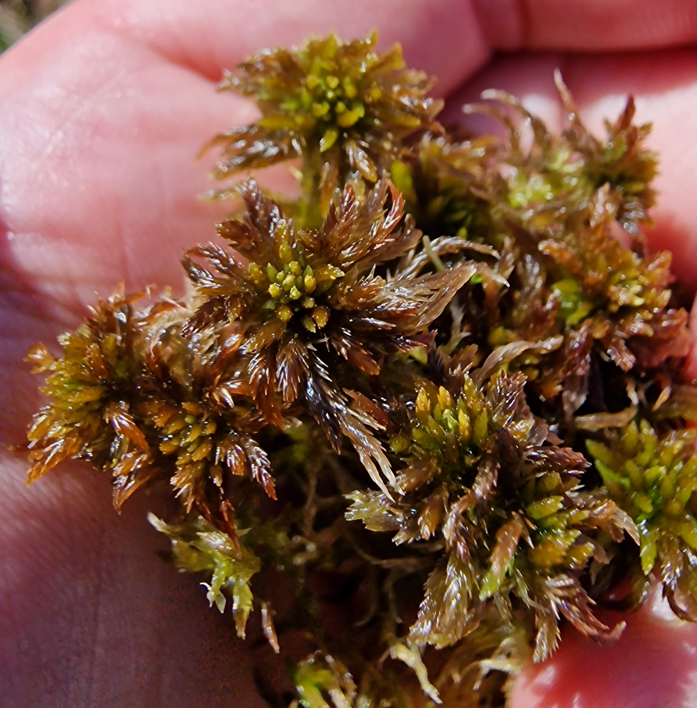
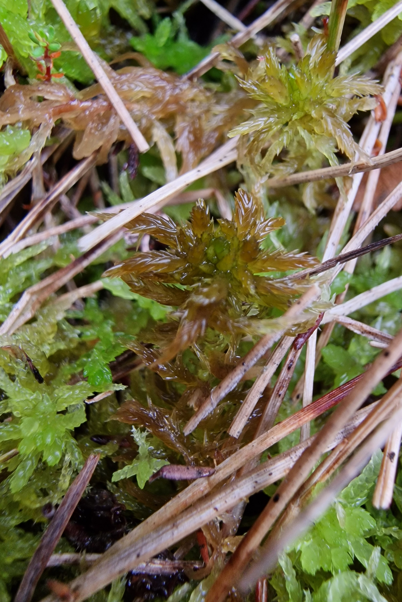

# Sphagnum annulatum

## Description

Small to medium size

Capitulum shiny chestnut brown.

Apical bud normally obvious, usually levelled or only slightly shorter than the inner branches, and almost always always visible.

Fascicles loosely arranged and typically displaying two divergent and 1–2 pendent branches that separate slightly from the main stem.

The divergent branches often curved downwards and are often pronouncedly thickest in middle part; the pendent branches are slender and shorter. The stem leaves stick out from the stem.

As moisture increases, the shoots and heads become more robust; the outer branches and projecting parts tend to elongate and straighten. Capitulum of male plantsdistinctly vaulted heads with short, dark-brown antheridial branches.

On rare occasions, a completely green color variant may occur.

Acts as a reliable indicator of minerothrophic wetlands. Never found in nutrient poor bogs.

## Macro

## Micro

## Lookalikes

S. majus
S. jensenii
S. balticum

Sphagnum jensenii is mainly differentiated from S. annulatum and S. balticum by its longer spreading branches, branch leaves and stem leaves.

The stem of Sphagnum annulatum (cross-section) has undifferentiated or poorly differentiated cortical cells, whereas the stems of S. majus and S. jensenii have clearly differentiated cortical cells.

Compared to S. jensenii, S. annulatum is less robust, smaller, more chestnut brown (less yellow-brown) and its branches are slightly curved; the capitulum is more clearly star-shaped with a distinct apical bud.

Sphagnum annulatum is very similar to Sphagnum jensenii, but the latter is more robust, has straighter branches, a less distinct terminal bud, few or no round pores in the hyaline cells on the convex side of the basal part of the branch leaf (where the hyaline cells are also longer compared to those in the middle part — note: S. annulatum can have larger pores in the basal part of the branch leaf, but reportedly "not longer"), stem leaves that are relatively broader, and stem cortex that is more clearly differentiated.

Parent species to S. jensenii together with S. balticum.

**Sources: Text & Images**:

Gilles Ayotte, Line Rochefort - Sphagnum Mosses of Eastern Canada-Éditions JFD (2020)

[Artfakta.se: krusvitmossa Sphagnum annulatum H.Lindb. ex Warnst.](https://artfakta.se/taxa/2883/information?src=1&class=11)

[Artsdatabanken.no: Pisktorvmose Sphagnum annulatum H.Lindb. ex Warnst](https://artsdatabanken.no/Pages/186268/)

**Additional Private Images**

