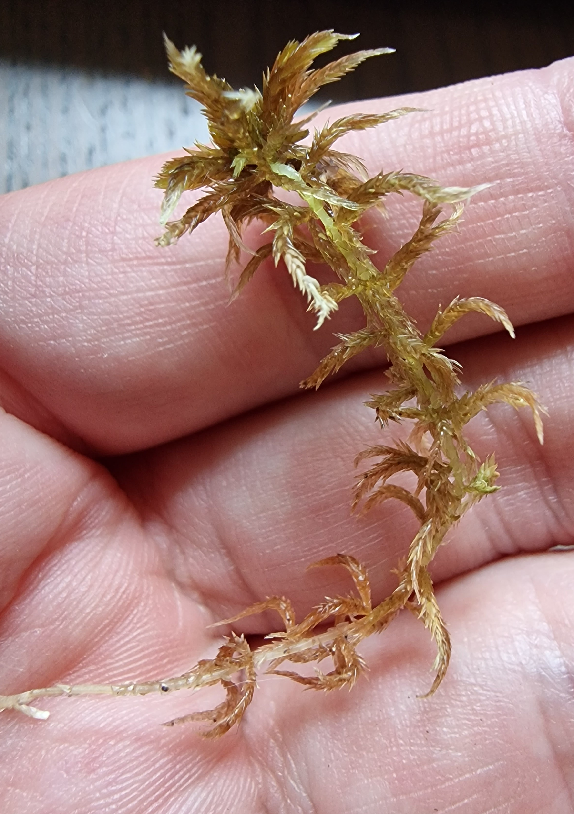
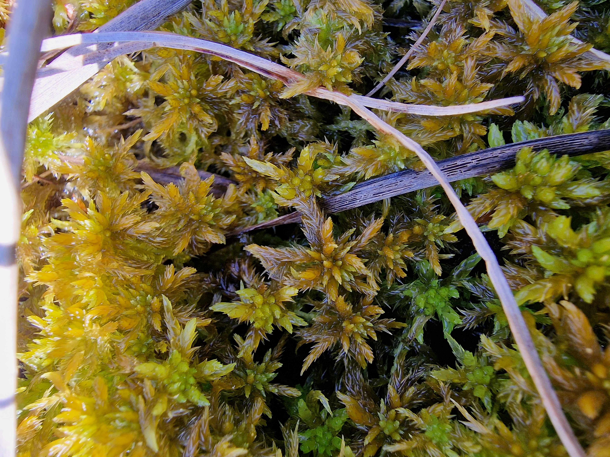
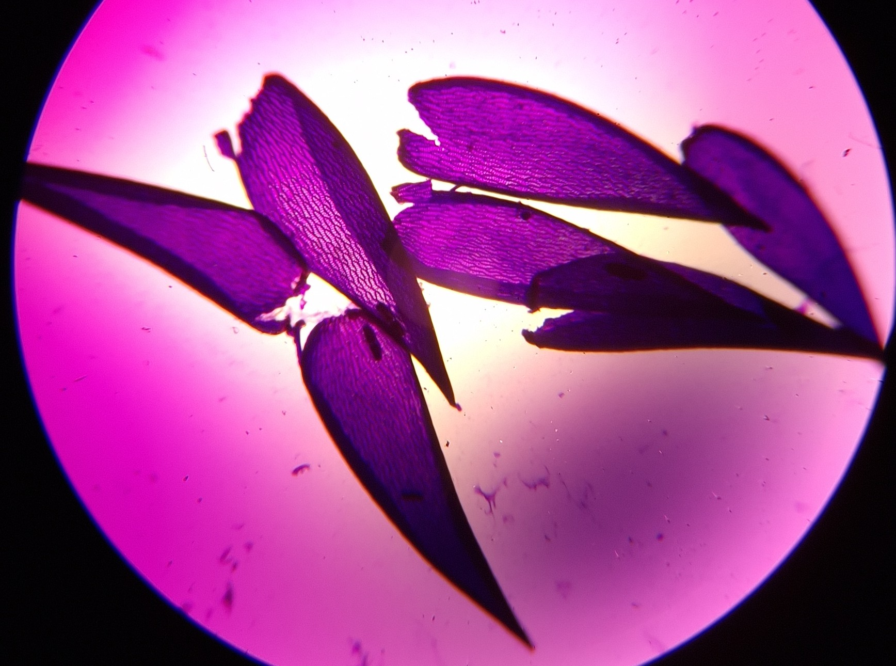

# Sphagnum annulatum

  

  
↑ Photo source: Kjell Ivar Flatberg, publisher: NTNU Vitenskapsmuseet, License CC BY 4.0

<nav class="toc" aria-label="Page contents">

## Contents

- [Description](#description)
  - [General](#general)
  - [Capitulum](#capitulum)
  - [Branches](#branches)
  - [Stem](#stem)
  - [Variation](#variation)
    - [Variation – macroscopic pictures](#variation-macro-pictures)
  - [Habitat](#habitat)
- [Macro pics](#macro-pics)
- [Micro pics](#micro-pics)
- [Sources](#sources)
- [Additional images](#additional-images)

</nav>

## Description<a href="#flatberg1988-annulatum">1</a> | <a href="#flatberg2015-annulatum">2</a> | <a href="#ayotte2020-eastern-canada">3</a> | <a href="#artfakta2026-annulatum">4</a> | <a href="#flatberg2002-norwegian-sphagna">5</a>

### General

Sphagnum annulatum is relatively constant in both macroscopic and microscopic characters. But is still varying from **small to moderate**, from green, **yellow** to **chestnut-brown** to sometimes orange-brown or red-brown. It's always glossy looking when moist (due to the many pores in its branch leaves). A completely green color variant exists but is rare.  

Commonly it has:

- A very prominent top bud which is never hidden by its inner capitulum branches
- A clearly star shaped capitulum
- A brown or orange colour
- A mostly pale stem with longer than wide stem leaves, which stick out from the stem
- Divergent branches with very short leaves at the base
- Branch leaves which are unranked and erecto-patent to imbricate in arrangement
- Branch leaf  very porose and in rows of one to two throughout and on both sides of the leaf
- Undifferentiated stem 

### 

The forms a slightly to distinctly  head. When viewed from above the **outer branches are straight to somewhat laterally curved**. And when viewed from the side they are **distinctly **. The is well developed and usually **equals or exceeds the inner branches in length, remaining clearly exposed rather than concealed**. In male plants during autumn, the capitulum becomes strongly convex and bears short, antheridial branches.

### Branches

 are usually situated loosely on the stem. Most of them carry two divergent branches with one or two  that most often stick a little out from the stem.  

The **divergent branches often curve towards the ground and tend to be thickest at the middle section of the branch.** The branch axis is often slightly reddish near the base.  
Along a divergent branch the branch leaves near the proximal end are **much shorter than those in the middle**, where they are broadly ovate-lanceolate, and in *S. annulatum* these tiny leaves is often very noticable (with a loupe). **Divergent branch leaves are unranked and can range from erecto-patent to commonly clearly .** Sometimes with **few to many leaves appearing straight to very .**  

The pendent branches are normally more slender and shorter than the divergent branches.  

### Stem

**The stem is pale**, sometimes with reddish-orange-lightbrown portions, especially when growing very wet and it being late in the season.  

**The stem leaves are more or less spread away from the stem itself** and are longer than wide. They are  to lingulate-triangular, medium to very curved concavely, and more often than not broadest at or just above the base. The tip is usually acute to a slightly bluntly acute, and only rarely narrowly truncate-erose at the very tip. On male plants the stem leaves are relatively shorter and broader, with a more obtuse apex than in females.  

### Variation

In the field it behaves as a fairly phenorigid species. Both the macroscopic and microscopic characters stay quite constant for a sphagnum species. Within mires it usually occupies only a short bit of the "dry-wet" ecogradient. Under its ordinary minerotrophic mire conditions the plants are mostly medium sized and **chestnut-brown**, as seen in the images at the top of this page. The capitulum branches look relatively straight when viewed from above.  
In  vegetation, especially in subalpine and alpine areas, plants are often dark orange to red-brown with a more strongly curved capitulum and more imbricate divergent branch leaves.  
There also exists a very rare permanently green morph.

#### Variation - Macroscopic Pictures { .collapse }

Below are some examples of how *S. annulatum* can look in the field. All of the plants shown are non-permanent forms that change with the season, the local "dry-wet" gradient and the "poor-rich" gradient.

### Habitat { .collapse }

*S. annulatum* works as an indicator of , and it is not found in .  

The species is predominantly a  plant. In Norway it also turns up in subalpine and low alpine areas, where it can grow in spring and snow-bed vegetation on very shallow peat. It is only found in minerotrophic conditions. It is most typical of sloping , but can also occur in  fens.  
Along the "poor-rich" vegetation gradient its ecological range is fairly narrow: it is found mainly in ****, occasionally in transitional **** and only rarely in ****. On the "hummock-mud-bottom" vegetation gradient it usually forms high-level  and ; it is less often seen in wetter carpets and only seldom at the beginning of the  level.  

## Macro Pics

  
↑ Photo source: Kjell Ivar Flatberg, publisher: NTNU Vitenskapsmuseet, License CC BY 4.0

  
↑ With "pa" S. papillosum, "li" S. lindbergii and "pu" S. pulchrum. Photo source: Kjell Ivar Flatberg, publisher: NTNU Vitenskapsmuseet, License CC BY 4.0

  
↑ Photo source: Kjell Ivar Flatberg, publisher: NTNU Vitenskapsmuseet, License CC BY 4.0

  
↑ Classic thickest in the middle of the divergent branches look

  
↑ Stem with stem leaves and some branches still attached

  
↑ Stem with stem leaves attached. Photo source: Kjell Ivar Flatberg, publisher: NTNU Vitenskapsmuseet, License CC BY 4.0

## Micro Pics

↑ Lingulate-triangular with a rounded and sometimes eroded tip. Hyalocysts fibrillose in the tip.

↑ Stem leaf to the left, branch leaf to the right. Photo source: Kjell Ivar Flatberg, publisher: NTNU Vitenskapsmuseet, License CC BY 4.0

↑ Stem leaf at the top (notice the fibrillose hyalocysts towards the tip), branch leaf in the middle and folded branch leaf at the bottom

↑ Hyalocysts of the bottom of the branch leaf most often has a similar length as in the middle section of the branch leaf

↑ Pores on convex side of the branch leaf in one to two rows. Very few or no interfibrillose intervals without pores

↑ Often very symmetrical looking pores in branch leaf

↑ Always has a good amount of pores on the concave side of the branch leaf, but these are often hard to see without heavy staining

↑ Stem cross section. Notice the undifferentiated and/or poorly developed cortical cells


------------------------------
# &nbsp; <!-- this ends the "lookalikes" collapse and protects the lower level headers below from the collapse feature -->

## **Sources: Text & Images**

Sources used in the description of the sphagnum. Pictures are taken by me unless a source is mentioned.

<ol>
  <li id="flatberg1988-annulatum">FLATBERG, K. I. (1988). Taxonomy of Sphagnum annulatum and related species. <em>Annales Botanici Fennici</em>, 25(4), 303–350. <a href="https://www.jstor.org/stable/23725638?read-now=1%3Fread-now%3D1&seq=32" target="_blank">https://www.jstor.org/stable/23725638</a></li>
  <li id="flatberg2015-annulatum">FLATBERG, K. I. (2015). Pisktorvmose <em>Sphagnum annulatum</em> H.Lindb. ex Warnst. NTNU Vitenskapsmuseet. <a href="https://artsdatabanken.no/arter/takson/188573/beskrivelse" target="_blank">https://artsdatabanken.no/arter/takson/188573/beskrivelse</a>. Retrieved [16/09/2025]</li>
  <li id="ayotte2020-eastern-canada">AYOTTE, G., &amp; ROCHEFORT, L. (2020). Sphagnum Mosses of Eastern Canada. Éditions JFD.</li>
  <li id="artfakta2026-annulatum">SLU ARTDATABANKEN (2026). Artfakta: krusvitmossa (<em>Sphagnum annulatum</em>). SLU Artdatabanken. <a href="https://artfakta.se/taxa/2883" target="_blank">https://artfakta.se/taxa/2883</a>. Retrieved [05/02/2026]</li>
  <li id="flatberg2002-norwegian-sphagna">FLATBERG, K. I. (2002). The Norwegian Sphagna: a field colour guide. Norges teknisk-naturvitenskapelige universitet. <a href="https://hdl.handle.net/11250/271981" target="_blank">https://hdl.handle.net/11250/271981</a>.</li>
</ol>

## **Additional Images taken by yours truely** { .collapse } 

  

  

  

  

  

  
↑ Can be found with  brown mosses (high nutrient demand)

  
↑ Can be reddish-brown

  

  

  

  

  

  

  

  

  

  

  

  

  

  
↑ Can be pretty sizable. Often S. lindbergii (middle left, and middle bottom of the image) is one of the largest European sphagnum.  

  

   

  
↑ Can be found in wide mats

  

   
↑ See blue arrows  

  

  

  

  

  
↑ Can be medium sized and slightly wild looking, but still has fairly straight capitulum branches when viewed from above. Also notice the long and slender stem leaves sticking out from the stem.

  
↑ Still has fairly straight capitulum branches when viewed from above.

  
↑ Also notice the long and slender stem leaves sticking out from the stem.

  

  
↑ Can have pores in one row instead of two as well  

  
↑ More commonly pores in two rows instead of one  

  
↑ Often has tiny ringed pores in the tip of the stem leaves  

  
↑ Common pore structure on concave side of branch leaf  

  
↑ Can sometimes have big and weirdly (not displayed in this image) shaped pores on the bottom, and sometimes throughout the branch leaves  
   
    
↑ More likely than not a good bit longer than wide stem leaf  
   
 

  
↑ Stem cortex not developed  

  
↑ Stem cortex slightly (1-2 rows) developed  

    
↑ Common branch leaf shape 

  
↑ Branch leaf cells of similar size from the bottom to the middle of the leaf  

  
↑ Branch leaf cells of similar size from the bottom to the middle of the leaf  

  
↑ Branch leaf cells of similar size from the bottom to the middle of the leaf  

  
↑ Branch leaf cells of similar size from the bottom to the middle of the leaf  
