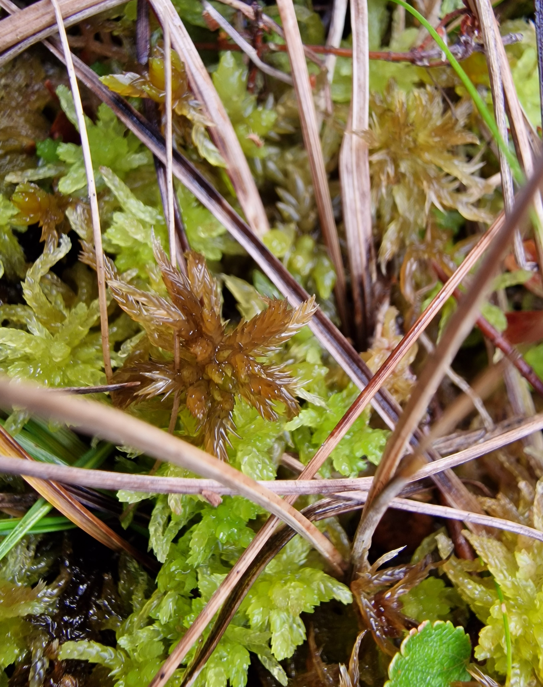

# Sphagnum annulatum

  

  
↑ Photo source: Kjell Ivar Flatberg, publisher: NTNU Vitenskapsmuseet, License CC BY 4.0

## Description<a href="#flatberg1988-annulatum">1</a> | <a href="#flatberg2015-annulatum">2</a>

### General

Sphagnum annulatum is a fairly phenorigid species. But still varying from **small to moderately robust**, from green, **yellow** to **chestnut-brown** to some-times orange-brown to red-brown, glossy looking when moist. On rare occasions, a completely green color variant may occur.  

- Very prominent top bud which is never hidden by its inner capitulum branches
- Most often has a clearly star shaped capitulum
- Brown or orange coloured
- Pale stem with longer than wide stem leaves which stick out from the stem
- Clearly shorter branch leaves at the base of the divergent branches, which gradually grows longer towards the middle of the branch

### 

 slightly to distinctly 5-radiate; **outer branches straight to somewhat laterally curved (as viewed from above) and distinctly arcuato-decurved (as viewed from the side);** relatively thick in their middle part and fairly abruptly tapering at the distal end; inner branches erect; **terminal bud conspicuous, usually longer than or as long as the inner branches of the capitulum and not concealed by them;** male capitulum during autumn strongly convex, with comparatively short and clavate outer antheridial branches.

### Branches

Fascicles loosely arranged and typically displaying two divergent and 1–2 pendent branches that separate slightly from the main stem.
**The divergent branches often curved downwards and are often pronouncedly thickest in middle part.**  
Divergent branch leaves distinctly shorter near the proximal end than in the middle part of the branch. Note: Many sphagnum can display smaller leaves at the base of the divergent branches, but S. annulatum often has the entire proximal end full of much smaller leaves than in the middle part of the branch. **Divergent branch leaves unranked, erecto-patently and distantly arranged to more commonly imbricate, straight to often markedly subsecund.** When dry slightly more spreading.  
The pendent branches are more slender and shorter than the divergent branches.  

### Stem

**Stem pale** or pale with red portions (particularly during late autumn and in wet habitats).
**Stem leaves ± spreading from stem when fresh**, longer than wide, lingulate to usually lingulate-triangular, moderately to distinctly concave and broadest at or just above the base; apex acute to acute-obtuse, rarely narrowly truncate-erose at the very end. Stem leaves of male plant relatively shorter and broader, and more obtuse at the apex than in female plants.  

### Variation

It is fairly phenorigid both macro and microscopically. It also has a fairly narrow habitat amplitude along the "dry-wet" ecogradient in its mire habitats. In mires it  is usually medium sized and chestnut brown, as seen in the images at the top of this page. The capitulum branches are also fairly straight when viewed from above.  
Sometimes, but mainly in fen vegetation in subalpine and alpine locations they are often dark orange to red-brown with a more curved capitulum and imbricate divergent branch leaves.  
As mentioned earlier there also exists a uncommon permanently green morph.

#### Variation Macroscopic Pictures { .collapse }

Here are some variations for what you can expect when looking for S. annulatum. All of the ones pictured are non-permanent variations which changes depending on the season, the "dry-wet" gradient and the "poor-rich" gradient.

### Habitat { .collapse }

Acts as a reliable indicator of minerothrophic wetlands. Not found in ombrotrophic bogs.  

Sphagnum annulatum is predominantly a mire species. But in subalpine and low alpine areas in Norway it is also sometimes found in spring and snow-bed vegetation on very shallow peat. In mires, it is an exclusively minerotrophic species. It prefers sloping fens, but is sometimes also found in topogenous fens.  
Along the "poor-rich" vegetational gradient, it has a fairly narrow amplitude; it occurs mainly in **intermediate fens**, more occasionally in transitional poor fens and rarely in rich fens. High-level carpets and **lawns** are the typical habitats on the "hummock-mud-bottom" vegetational gradient. More occasionally it is found in wetter carpets, and rarely at low hummock level. The surrounding vegetation always has a clear mire margin character.

## Macro Pics

  

  
↑ Photo source: Kjell Ivar Flatberg, publisher: NTNU Vitenskapsmuseet, License CC BY 4.0

  
↑ With "pa" S. papillosum, "li" S. lindbergii and "pu" S. pulchrum. Photo source: Kjell Ivar Flatberg, publisher: NTNU Vitenskapsmuseet, License CC BY 4.0

  
↑ Photo source: Kjell Ivar Flatberg, publisher: NTNU Vitenskapsmuseet, License CC BY 4.0

  
↑ Classic thickest in the middle of the divergent branches look

  
↑ Stem with stem leaves and some branches still attached

  
↑ Stem with stem leaves attached. Photo source: Kjell Ivar Flatberg, publisher: NTNU Vitenskapsmuseet, License CC BY 4.0

## Micro Pics

↑ Lingulate-triangular with a rounded and sometimes eroded tip. Hyalocysts fibrillose in the tip.

↑ Stem leaf to the left, branch leaf to the right. Photo source: Kjell Ivar Flatberg, publisher: NTNU Vitenskapsmuseet, License CC BY 4.0

↑ Stem leaf at the top (notice the fibrillose hyalocysts towards the tip), branch leaf in the middle and folded branch leaf at the bottom

↑ Hyalocysts of the bottom of the branch leaf most often has a similar length as in the middle section of the branch leaf

↑ Pores on convex side of the branch leaf in one to two rows. Very few or no interfibrillose intervals without pores

↑ Often very symmetrical looking pores in branch leaf

↑ Always has a good amount of pores on the concave side of the branch leaf, but these are often hard to see without heavy staining

↑ Stem cross section. Notice the undifferentiated and/or poorly developed cortical cells


------------------------------
# &nbsp; <!-- this ends the "lookalikes" collapse and protects the lower level headers below from the collapse feature -->

## **Sources: Text & Images**

<ol>
  <li id="flatberg1988-annulatum">FLATBERG, K. I. (1988). Taxonomy of Sphagnum annulatum and related species. <em>Annales Botanici Fennici</em>, 25(4), 303–350. <a href="https://www.jstor.org/stable/23725638?read-now=1%3Fread-now%3D1&seq=32" target="_blank">http://www.jstor.org/stable/23725638</a></li>
  <li id="flatberg2015-annulatum">FLATBERG, K. I. (2015). Pisktorvmose <em>Sphagnum annulatum</em> H.Lindb. ex Warnst. <a href="https://www.artsdatabanken.no/Pages/186268" target="_blank">www.artsdatabanken.no/Pages/186268</a>. Retrieved [16/09/2025]</li>
</ol>

Gilles Ayotte, Line Rochefort - Sphagnum Mosses of Eastern Canada-Éditions JFD (2020)

[Artfakta.se: krusvitmossa Sphagnum annulatum H.Lindb. ex Warnst.](https://artfakta.se/taxa/2883/information?src=1&class=11)

[Artsdatabanken.no: Pisktorvmose Sphagnum annulatum H.Lindb. ex Warnst](https://artsdatabanken.no/Pages/186268/)

[The Norwegian Sphagna: a field colour guide](https://ntnuopen.ntnu.no/ntnu-xmlui/handle/11250/271981)

## **Additional Images taken by yours truely** { .collapse } 

  

  

  

  

  

  
↑ Can be found with  brown mosses (high nutrient demand)

  
↑ Can be reddish-brown

  

  

  

  

  

  

  

  

  

  

  

  

  

  
↑ Can be pretty sizable. Often S. lindbergii (middle left, and middle bottom of the image) is one of the largest European sphagnum.  

  

   

  
↑ Can be found in wide mats

  

   
↑ See blue arrows  

  

  

  

  

  
↑ Can be medium sized and slightly wild looking, but still has fairly straight capitulum branches when viewed from above. Also notice the long and slender stem leaves sticking out from the stem.

  
↑ Still has fairly straight capitulum branches when viewed from above.

  
↑ Also notice the long and slender stem leaves sticking out from the stem.

  

  
↑ Can have pores in one row instead of two as well  

  
↑ More commonly pores in two rows instead of one  

  
↑ Often has tiny ringed pores in the tip of the stem leaves  

  
↑ Common pore structure on concave side of branch leaf  

  
↑ Can sometimes have big and weirdly (not displayed in this image) shaped pores on the bottom, and sometimes throughout the branch leaves  
   
    
↑ More likely than not a good bit longer than wide stem leaf  
   
 

  
↑ Stem cortex not developed  

  
↑ Stem cortex slightly (1-2 rows) developed  

    
↑ Common branch leaf shape 

  
↑ Branch leaf cells of similar size from the bottom to the middle of the leaf  

  
↑ Branch leaf cells of similar size from the bottom to the middle of the leaf  

  
↑ Branch leaf cells of similar size from the bottom to the middle of the leaf  

  
↑ Branch leaf cells of similar size from the bottom to the middle of the leaf  
